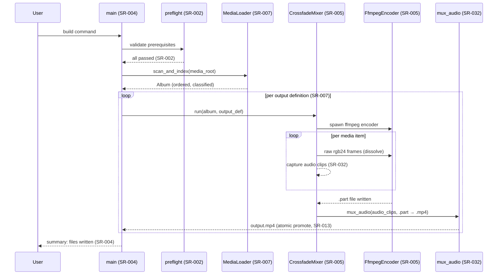
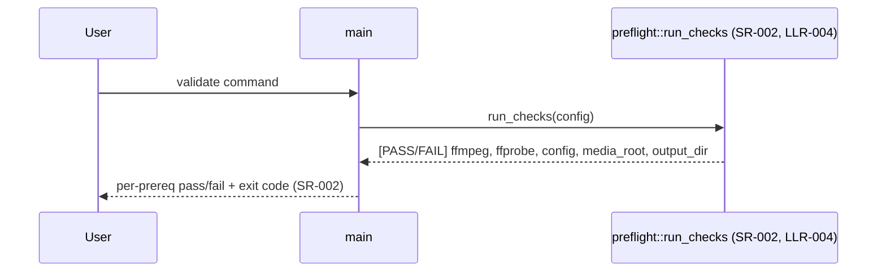
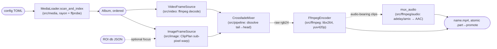
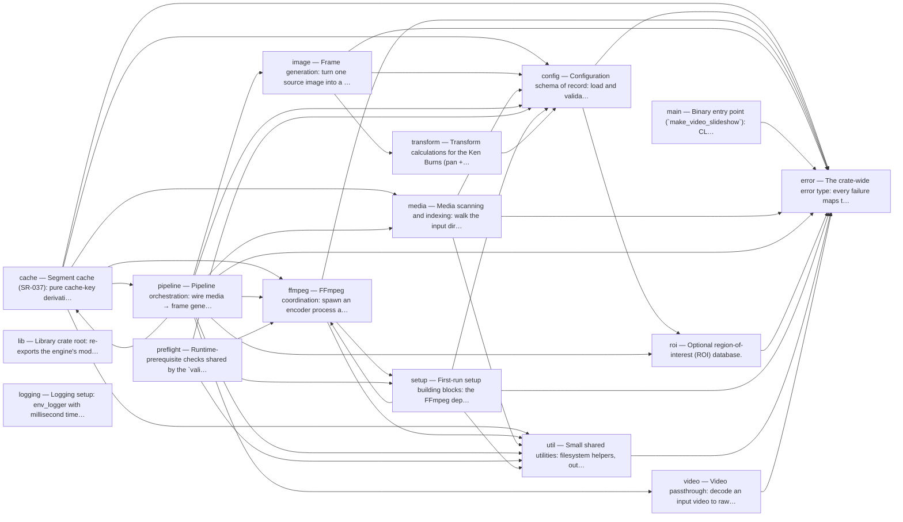

# Architecture (one page)

Owned by the [Software Engineer persona](../.claude/agents/software-engineer.md). The **overview** below is hand-written and must stay within one screen; the **module/function map** and the **dependency diagram** are generated by `Scripts/trace.ps1` so they cannot drift (see [process.md §3](process.md#3-traceability--anti-duplication)). Summaries and `<- SR/LLR` back-links in the map are harvested from the `//!` headers and `Implements:` comments in the code — comment for humans and the map both stay current.

Back to [docs index](README.md) · [README](../README.md).

## Runtime flows

> Required from G2 on (process.md §3). Each diagram is a Mermaid sequence or
> graph diagram citing the SR/LLR ids it renders. Updated in the same commit as
> any LLR change that alters a depicted flow.

### Build pipeline — happy path (SR-004, SR-005, SR-032)

Data-flow view of a single output: config → scan → frame generation → encode.
The `CrossfadeMixer` orchestrates the dissolve; `FfmpegEncoder` consumes frames
via stdin. Audio clips are captured out-of-band and muxed after encode.
(Implements: SR-004, SR-005, SR-007, SR-032.)



### Validate command (SR-002)



### Warm build with segment cache (SR-037; OBJ-PERF Phase 2 — shipped)

**Implemented (Round 5a spike + Round 5b, TC-075..081):** the diagram below is
the **default `build` path** (`--no-cache` selects the pre-cache streaming
pipeline). `CrossfadeMixer` writes through a `FrameSink` (streaming encoder or
`SegmentedEncoderSink`), rolling to a fresh MPEG-TS segment at each transition
midpoint; `plan_segments` partitions the album hit/miss against the keyed
`SegmentStore` (LLR-053/054/055) and only contiguous **miss runs** are
rendered — each run re-encodes its member clips plus the adjacent context clip
per side (whose overlap frames sit inside the run's segments); a mid-run skip
(SR-014) or a wrong video-length estimate triggers a cheap re-plan with the
recorded actual frame counts. `concat_segments` assembles hits + fresh
segments by stream-copy through the **existing** watchdog, disk-full mapping,
and atomic promote (LLR-056 — SR-011, SR-013, SR-015); audio delays come from
the plan's frame offsets and feed the unchanged mux (LLR-057, LLR-040,
SR-032). `.ts` is the validated segment container (LLR-054).

```mermaid
sequenceDiagram
    participant Pipe as FrameGenerationPipeline (SR-037)
    participant Plan as cache planner (LLR-055)
    participant Store as SegmentStore (LLR-054)
    participant Enc as segment render+encode (SR-005)
    participant Cat as concat_segments (LLR-056)
    participant Mux as mux_audio (SR-032, LLR-057)

    Pipe->>Plan: plan_segments(album, output_def)
    Plan->>Store: lookup(segment_key) per segment (LLR-053)
    Store-->>Plan: hit | miss (corrupt entry = miss, SR-037)
    loop cache misses only (SR-037)
        Plan->>Enc: render + encode segment
        Enc-->>Store: insert(key, segment.ts)
    end
    Plan->>Cat: ordered segment list (stream-copy, no re-encode)
    Note over Cat: watchdog-armed + disk-full mapped (SR-013, SR-015)
    Cat-->>Pipe: silent .part
    Pipe->>Mux: audio clips at concat-timeline start frames (LLR-040)
    Mux-->>Pipe: name.mp4 via atomic promote (SR-011)
    Note over Store: LRU prune to size cap; --no-cache / --clear-cache (LLR-054)
```

### Overlapped pipeline (Phases 1b + 3 shipped)

**Implemented (Phase 1b + Phase 3, TC-089/TC-090):** the bounded
`ClipPrefetcher` (LLR-060) decodes+prescales the next image clip on a
background thread and feeds the clip loop in order (errors included →
`record_skip`, SR-014); the render pool stays rayon inside the mixer thread,
pulling bounded batches; and the `EncoderWriter` thread (LLR-063) owns the
ffmpeg stdin behind a bounded channel (`writer_channel_depth`: ~2× fade
frames, byte-capped), so rendering never blocks on pipe writes and vice
versa. That depth — not the deleted `RANGE_MEMORY_BUDGET` — bounds in-flight
frame memory (PB-005 guard). Both build paths route through the writer: the
streaming encoder and the SR-037 `SegmentedEncoderSink` (rolls queue in-order
with frames). Failure semantics are preserved across the thread boundary
(LLR-064 — SR-011, SR-013, SR-015): a writer error disconnects the channel
(senders unblock, no deadlock), the inner sink drops on the thread (encoder
Drop kills ffmpeg, removes the `.part`), and `EncoderWriter::join` re-raises
the error in `encode_output` exactly as the serial path did. The mixer-side
`encode-write-stall` timer now measures channel back-pressure; the raw pipe
time accrues separately as `pipe-write` on the writer thread (SR-036).

```mermaid
sequenceDiagram
    participant Pre as ClipPrefetcher (LLR-060)
    participant Pool as render pool, rayon (LLR-061)
    participant Mix as CrossfadeMixer (LLR-062)
    participant Wr as EncoderWriter thread (LLR-063)
    participant FF as ffmpeg stdin (SR-013)

    Note over Pre,Wr: all channels bounded — peak memory capped (LLR-063, SR-036)
    Pre->>Pool: decoded+prescaled clip N+1 (lookahead 1-2)
    Pre-->>Mix: prefetch error, in order -> record_skip (SR-014)
    Pool->>Mix: ordered rendered frames (bounded batch pull, rayon in mixer thread)
    Mix->>Wr: blended frames (bounded channel, ~2x fade_frames)
    Wr->>FF: write_frame — sole watchdog-activity bump (SR-013)
    FF-->>Wr: disk-full / broken-pipe error (SR-015)
    Wr-->>Mix: Result re-raised by join; .part cleanup unchanged (SR-011, LLR-064)
```

### GPU render path (SR-039; OBJ-PERF Phase 4a — designed Round 7b, implementation lands Round 7d)

**Designed (LLR-066..LLR-074, Draft):** the frame renderer goes behind a
`ClipRenderer` trait — today's `FrameRenderer` is the CPU impl and correctness
reference — while decode+prescale stay shared and CPU-side as a backend-blind
`LoadedClip` from the unchanged `ClipPrefetcher` (LLR-066: prescale is 1.5% of
rot-15 wall, so the GPU uploads the small prescaled image, not the full
decode). Backend selection is the SR-034 pattern replayed: a process-wide-once
wgpu adapter probe plus a pure `select_backend` decision table (LLR-067,
LLR-068), falling back to CPU with a logged reason — never a failed build
(SR-039). The GPU impl uploads each clip's texture once (LLR-069), then per
frame draws one textured quad through a matrix the **CPU** computes from
`ClipPlan::projection(i)` — the shader re-derives no motion math (LLR-070,
SR-022 per-backend determinism) — and reads back through a 3-deep async
staging-buffer ring into rgb24 frames shape-identical to the CPU path
(LLR-071), so mixer/writer/encoder are untouched. Blend stays in the CPU
`CrossfadeMixer` (LLR-062; 2.6% share — render-only scope recorded in
LLR-070), and the stdin pipe-write share is the recorded Phase-4b boundary
(LLR-071). Device loss mid-build completes the in-flight range on the CPU from
the retained `LoadedClip` and degrades the rest of the build to CPU, logged —
never skipped, never failed (LLR-072). Cross-backend similarity is
tolerance-checked via `frame_mean_abs_diff` (LLR-073); deps wgpu + bytemuck +
pollster are justified/costed in LLR-074.

```mermaid
sequenceDiagram
    participant Cfg as render_backend config (LLR-067)
    participant Sel as probe_adapter + select_backend (LLR-068)
    participant Pre as ClipPrefetcher — LoadedClip, backend-blind (LLR-060, LLR-066)
    participant Gpu as GpuRenderer (LLR-069, LLR-070, LLR-074)
    participant Ring as ReadbackRing, 3-deep async map (LLR-071)
    participant Src as ImageFrameSource via ClipRenderer (LLR-066)

    Cfg->>Sel: auto | cpu | gpu (SR-039)
    Note over Sel: probe once per process; adapter absent / probe fail -> CPU + logged reason — never a build failure (SR-039)
    Sel-->>Src: backend selected; backend-in-use reported at build start (LLR-072)
    Pre->>Gpu: decoded+prescaled LoadedClip (prescale stays CPU, LLR-066)
    Gpu->>Gpu: upload clip texture once — Rgba8, bilinear sampler (LLR-069)
    loop per frame
        Src->>Gpu: render_range(i..j)
        Gpu->>Gpu: CPU computes ClipPlan projection(i) -> FrameUniforms (SR-022, LLR-070)
        Gpu->>Ring: draw textured quad -> copy to staging buffer (LLR-071)
        Ring-->>Src: rgb24 Vec<u8> — FrameSource contract unchanged (SR-039)
    end
    Note over Src: blend stays CPU in CrossfadeMixer (LLR-062) — render-only Phase-4a scope (LLR-070)
    Note over Gpu: device lost mid-clip -> retained LoadedClip completes the range on CPU, build degrades to CPU, warning logged (LLR-072, LLR-073)
```

## High-level flow (Rust engine)



## Module responsibilities

| Module | Responsibility |
|---|---|
| `src/cache` | SR-037 segment cache: pure key derivation, keyed `.ts` store (LRU), warm-build planner |
| `src/config` | Load/validate TOML config (`OutputDef`, Ken Burns + audio params, config location) |
| `src/media` | Parallel scan, classify, dimensions/duration, audio probe, ignore patterns, SR-038 probe cache |
| `src/transform` | `ClipPlan`: Ken Burns sub-pixel projection + rotation math (deterministic, optional fixed focus) |
| `src/image` | `FrameRenderer`: pre-scale once, per-frame single-warp render |
| `src/roi` | Optional region-of-interest database (per-image focus override) |
| `src/video` | `VideoFrameReader`: stream decoded frames from ffmpeg |
| `src/ffmpeg` | `FfmpegEncoder` (raw rgb24 → H.264 MP4), FFmpeg resolution order, audio mux |
| `src/pipeline` | `FrameSource` abstraction + `CrossfadeMixer` orchestration + audio-clip capture |
| `src/setup` | First-run self-check: FFmpeg resolve/fetch, GUI wizard, config builder |
| `src/preflight` | Runtime-prerequisite checks shared by `validate` and `build` |
| `src/util` | dirs, size estimation, stage timers + perf-metrics writer (SR-036) |

## Module dependencies (generated)

The internal `crate::` reference graph — each arrow is a dependency, so a layering violation (e.g. a pure core importing the encoder shell) is visible at a glance.

<!-- BEGIN GENERATED DEPENDENCY DIAGRAM (scripts/trace.ps1) -->
_Generated by `scripts/trace.ps1`: each arrow is a `crate::` reference between top-level modules. Do not edit by hand._


<!-- END GENERATED DEPENDENCY DIAGRAM -->

## Module map (generated)

<!-- BEGIN GENERATED MODULE MAP (scripts/trace.ps1) -->
_Generated 2026-07-18 by `scripts/trace.ps1` from the source tree — do not edit by hand. Each file's summary is its first `//!` line; `<- SR/LLR` are the `Implements:` back-links found at the item; `uses:` lists in-tree modules the file references (`crate::`)._

- **src/cache/mod.rs** — _Segment cache (SR-037): pure cache-key derivation for per-clip encoded_
  - uses: `config`, `media`, `util`
  - `pub fn engine_version() -> String`  <- LLR-053, SR-037
  - `pub struct SourceIdentity`  <- LLR-053, SR-022, SR-037
  - `pub fn of(file: &MediaFile) -> Self`
  - `pub struct EncodeParams`  <- LLR-047, LLR-053, SR-037
  - `pub fn of(def: &OutputDef, resolved_encoder: &str) -> Self`  <- SR-006
  - `pub struct SegmentKeyInput<'a>`  <- LLR-053, SR-037
  - `pub fn segment_key(input: &SegmentKeyInput) -> String`  <- LLR-053, SR-037
  - `pub fn combine_keys(member_keys: &[String]) -> String`  <- LLR-053, LLR-055, SR-037
  - `pub fn clip_frames_key(id: &SourceIdentity, fps: u32) -> String`  <- LLR-055, SR-037
- **src/cache/planner.rs** — _Warm-build segment planner (SR-037): pure frame-layout arithmetic mirroring_
  - uses: `config`, `ffmpeg`, `pipeline`
  - `pub struct ClipFacts`  <- LLR-055, LLR-057, SR-037
  - `pub struct ClipLayout`  <- LLR-055, LLR-057, SR-037
  - `pub fn clip_layout(counts: &[u64], fade: usize) -> ClipLayout`  <- LLR-055, LLR-057, SR-037
  - `pub struct PlannedSegment`  <- LLR-055, SR-037
  - `pub struct SegmentPlan`  <- LLR-055, LLR-057, SR-037
  - `pub fn hits(&self) -> usize`
  - `pub fn misses(&self) -> usize`
  - `pub fn audio_clips(&self, clips: &[ClipFacts]) -> Vec<AudioClip>`  <- LLR-040, LLR-057, SR-032, SR-037
  - `pub fn audio_clips_from(clips: &[ClipFacts], layout: &ClipLayout) -> Vec<AudioClip>`  <- LLR-057, SR-032, SR-037
  - `pub fn segment_groups(clip_count: usize, layout: &ClipLayout) -> Vec<Range<usize>>`  <- LLR-055, SR-037
  - `pub fn group_key(`  <- LLR-053, LLR-055, SR-037
  - `pub fn plan_segments<F>(`  <- LLR-055, SR-037
- **src/cache/store.rs** — _Segment store (SR-037): on-disk cache of encoded MPEG-TS segments plus a_
  - uses: `error`, `util`
  - `pub struct SegmentMeta`  <- LLR-054, SR-037
  - `pub struct SegmentStore`  <- LLR-054, SR-037
  - `pub fn root_for(temp_dir: Option<&Path>) -> PathBuf`  <- LLR-054, SR-037
  - `pub fn open(root: &Path) -> Result<Self>`  <- LLR-054, SR-037
  - `pub fn segment_path(&self, key: &str) -> PathBuf`
  - `pub fn staging_dir(&self) -> Result<PathBuf>`
  - `pub fn lookup(&mut self, key: &str) -> Option<(PathBuf, u64)>`  <- LLR-054, SR-037
  - `pub fn commit(&mut self, key: &str, staged: &Path, frames: u64) -> Result<PathBuf>`  <- LLR-054, SR-037
  - `pub fn record_clip_frames(&mut self, id: &SourceIdentity, fps: u32, frames: u64)`  <- LLR-055, SR-037
  - `pub fn clip_frames(&mut self, id: &SourceIdentity, fps: u32) -> Option<u64>`  <- LLR-055, SR-037
  - `pub fn total_bytes(&self) -> u64`
  - `pub fn prune_to(&mut self, cap_bytes: u64)`  <- LLR-054, SR-037
- **src/config/location.rs** — _Config file location (SR-030): the config lives beside the executable when_
  - `pub fn choose_config_dir(`  <- LLR-035, SR-030
  - `pub fn resolve_config_path() -> PathBuf`  <- LLR-035, SR-030
- **src/config/mod.rs** — _Configuration schema of record: load and validate the TOML config_
  - uses: `error`, `roi`
  - `pub struct Config`
  - `pub struct InputConfig`
  - `pub struct OutputConfig`  <- LLR-038, SR-031
  - `pub struct ProcessingConfig`
  - `pub struct OutputDef`  <- LLR-008, SR-013
  - `pub fn total_frames(&self) -> u32`
  - `pub fn fade_frames(&self) -> u32`
  - `pub fn even_dims(&self) -> (u32, u32)`  <- LLR-010, SR-005, SR-006
  - `pub fn from_file(path: &std::path::Path) -> Result<Self>`
  - `pub fn validate(&self) -> Result<()>`
- **src/error.rs** — _The crate-wide error type: every failure maps to a `SlideshowError`_
  - `pub enum SlideshowError`
- **src/ffmpeg/audio.rs** — _Audio passthrough: mux source-video audio onto the (silent) slideshow video._
  - uses: `error`
  - `pub struct AudioClip`
  - `pub struct AudioParams`
  - `pub fn delay_ms(start_frame: u64, fps: u32) -> u64`  <- LLR-040, SR-032
  - `pub fn mux_audio(`  <- LLR-041, SR-011, SR-032
- **src/ffmpeg/concat.rs** — _Stream-copy concat assembly of per-clip segments into one MP4 (SR-037):_
  - uses: `error`, `util`
  - `pub fn concat_segments(`  <- LLR-056, SR-005, SR-011, SR-013, SR-015, SR-037
- **src/ffmpeg/encoder_args.rs** — _Pure mapping from an encoder choice to the FFmpeg output-side argument_
  - `pub enum EncoderChoice`  <- LLR-045, LLR-049, SR-034, SR-035
  - `pub fn codec_name(self) -> &'static str`
  - `pub enum EncoderRequest`  <- LLR-047, SR-034
  - `pub fn parse(s: &str) -> Self`  <- LLR-047, SR-034
  - `pub fn encoder_args(choice: EncoderChoice, crf: u32, x264_preset: &str) -> Vec<String>`  <- LLR-045, LLR-049, SR-005, SR-034, SR-035
  - `pub fn segment_encoder_args(choice: EncoderChoice, crf: u32, x264_preset: &str) -> Vec<String>`  <- LLR-054, LLR-056, SR-005, SR-037
  - `pub struct EncoderSettings`  <- LLR-045, LLR-049, SR-034, SR-035
  - `pub fn software(crf: u32) -> Self`  <- SR-034
  - `pub fn args(&self) -> Vec<String>`
  - `pub fn segment_args(&self) -> Vec<String>`  <- SR-037
- **src/ffmpeg/mod.rs** — _FFmpeg coordination: spawn an encoder process and stream raw `rgb24` frames_
  - uses: `error`, `util`
  - `pub struct FfmpegEncoder`
  - `pub fn start(`  <- LLR-008, LLR-015, LLR-045, SR-005, SR-011, SR-013, SR-034, SR-035
  - `pub fn start_segment(`  <- LLR-056, SR-011, SR-013, SR-037
  - `pub fn write_frame(&mut self, data: &[u8]) -> Result<()>`  <- LLR-008, SR-013
  - `pub fn finish(self) -> Result<()>`  <- LLR-008, LLR-015, SR-011, SR-013, SR-015, SR-037
  - `pub fn finish_to_part(mut self) -> Result<PathBuf>`  <- LLR-008, LLR-015, LLR-041, SR-011, SR-013
  - `pub fn promote(src: &Path, final_path: &Path) -> Result<()>`  <- LLR-015, LLR-041, SR-011, SR-015
- **src/ffmpeg/probe.rs** — _Preflight hardware-encoder probe and fallback selection (SR-034): list the_
  - uses: `setup`
  - `pub enum ProbeOutcome`  <- LLR-046, SR-034
  - `pub fn parse_encoders(listing: &str) -> HashSet<String>`  <- LLR-046, SR-034
  - `pub fn classify_trial(success: bool, stderr: &str) -> ProbeOutcome`  <- LLR-046, SR-034
  - `pub fn classify_probe<F: FnOnce() -> (bool, String)>(listed: bool, trial: F) -> ProbeOutcome`  <- LLR-046, SR-034
  - `pub fn probe_encoder(ffmpeg: &Path, encoder: &str) -> ProbeOutcome`  <- LLR-032, LLR-046, SR-034
  - `pub struct ProbeCache`  <- LLR-046, SR-017, SR-034
  - `pub fn new() -> Self`
  - `pub fn outcome_with<F: FnOnce(&Path, &str) -> ProbeOutcome>(`
  - `pub fn outcome(&mut self, ffmpeg: &Path, encoder: &str) -> ProbeOutcome`
  - `pub struct Selection`  <- LLR-048, SR-034
  - `pub fn describe(&self) -> String`  <- LLR-048
  - `pub fn select_encoder(`  <- LLR-048, SR-034
- **src/ffmpeg/resolve.rs** — _FFmpeg resolution order (SR-027): an explicitly configured `ffmpeg_path`_
  - `pub enum Source`
  - `pub fn pick(configured_ok: bool, on_path: bool, cached_ok: bool) -> Option<Source>`  <- LLR-032, SR-027
  - `pub fn resolve(configured: Option<&Path>, cache_dir: &Path) -> Option<PathBuf>`  <- LLR-032, SR-027
- **src/image/mod.rs** — _Frame generation: turn one source image into a sequence of RGB frames_
  - uses: `config`, `error`, `transform`
  - `pub struct LoadTimings`  <- LLR-050, LLR-060, SR-036
  - `pub struct FrameRenderer`
  - `pub fn load(path: &Path, out: &OutputDef) -> Result<Self>`
  - `pub fn load_with_focus(`  <- LLR-037, SR-031
  - `pub fn load_timings(&self) -> LoadTimings`  <- LLR-050, SR-036
  - `pub fn total_frames(&self) -> u32`  <- LLR-050, SR-036
  - `pub fn uses_fast_path(&self) -> bool`  <- LLR-061, SR-036
  - `pub fn render_range(&self, start: u32, end: u32) -> Vec<Vec<u8>>`
- **src/lib.rs** — _Library crate root: re-exports the engine's modules so integration tests_
- **src/logging.rs** — _Logging setup: env_logger with millisecond timestamps; `--verbose`_
  - `pub fn init_logging(verbose: bool) -> std::io::Result<()>`
- **src/main.rs** — _Binary entry point (`make_video_slideshow`): CLI parsing (build /_
  - uses: `error`
- **src/media/mod.rs** — _Media scanning and indexing: walk the input directory in parallel, classify_
  - uses: `config`, `error`
  - `pub struct MediaFile`
  - `pub enum MediaType`  <- LLR-039, SR-032
  - `pub struct ProbeStats`  <- LLR-059, SR-038
  - `pub struct Album`
  - `pub struct MediaLoader`  <- SR-038
  - `pub fn new(config: InputConfig) -> Self`  <- LLR-058, SR-038
  - `pub fn with_probe_cache_path(mut self, path: PathBuf) -> Self`  <- LLR-058, SR-038
  - `pub fn scan_and_index(&self) -> Result<Album>`  <- LLR-058, LLR-059, SR-038
- **src/media/probe_cache.rs** — _Media-scan probe cache (SR-038): JSON persistence of per-file probe_
  - uses: `error`, `util`
  - `pub struct ProbeEntry`  <- LLR-058, SR-038
  - `pub fn entry_current(entry: &ProbeEntry, size: u64, mtime_ms: u64) -> bool`  <- LLR-059, SR-038
  - `pub struct ProbeCache`  <- LLR-058, SR-038
  - `pub fn path_for(media_root: &Path) -> PathBuf`  <- LLR-058, SR-038
  - `pub fn load(path: &Path) -> Self`  <- LLR-058, SR-038
  - `pub fn save(&self, path: &Path) -> Result<()>`  <- LLR-058, SR-038
  - `pub fn lookup(`  <- LLR-059, SR-038
  - `pub fn insert(&mut self, rel: String, entry: ProbeEntry)`
- **src/pipeline/mod.rs** — _Pipeline orchestration: wire media → frame generation → FFmpeg encoding,_
  - uses: `cache`, `config`, `error`, `ffmpeg`, `media`, `roi`, `util`, `video`
  - `pub trait FrameSink`  <- LLR-056, LLR-063, SR-037
  - `pub struct SkippedInput`  <- LLR-017, SR-014
  - `pub struct WrittenOutput`  <- LLR-023, LLR-024, SR-004
  - `pub struct OutputTimings`  <- LLR-050, LLR-052, SR-036
  - `pub struct BuildSummary`  <- LLR-017, LLR-023, LLR-024, SR-004, SR-014
  - `pub fn oversize_outputs(&self) -> Vec<&WrittenOutput>`  <- LLR-013, SR-009
  - `pub struct FrameGenerationPipeline`
  - `pub fn new(`  <- SR-036
  - `pub fn execute(&self) -> Result<BuildSummary>`  <- LLR-017, LLR-019, LLR-023, LLR-024, SR-004, SR-014
  - `pub fn execute_cached(&self, store: &mut SegmentStore) -> Result<BuildSummary>`  <- LLR-054, LLR-055, SR-014, SR-037
  - `pub fn execute_segmented(`  <- LLR-040, LLR-041, LLR-053, LLR-054, LLR-055, LLR-056, LLR-057, SR-011, SR-013, SR-014, SR-032, SR-037
  - `pub struct SegmentedBuild`  <- LLR-055, LLR-056, SR-037
- **src/pipeline/overlap.rs** — _Encoder-writer thread (Phase 3 pipeline overlap, plan §5): the mixer emits_
  - uses: `error`, `ffmpeg`, `util`
  - `pub fn writer_channel_depth(fade_frames: usize, frame_bytes: usize) -> usize`  <- LLR-063, SR-036
  - `pub struct EncoderWriter<S: FrameSink + Send + 'static>`  <- LLR-063, LLR-064, SR-011, SR-013, SR-015, SR-036
  - `pub fn start(sink: S, depth: usize, timings: Arc<StageTimings>) -> Self`  <- SR-036
  - `pub fn join(mut self) -> Result<S>`  <- LLR-064, SR-011, SR-013, SR-015
- **src/pipeline/prefetch.rs** — _Background clip prefetch (plan §3 1b): decode+prescale the *next* image_
  - uses: `config`, `error`, `image`
  - `pub struct PrefetchJob`  <- LLR-060, SR-031, SR-036
  - `pub struct ClipPrefetcher`  <- LLR-060, SR-014, SR-036
  - `pub fn spawn(jobs: Vec<PrefetchJob>, out: OutputDef) -> Self`
  - `pub fn next(&mut self) -> Option<(usize, Result<FrameRenderer>)>`
- **src/pipeline/segment.rs** — _Segment-rolling frame sink (SR-037 spike foundation): encodes the mixer's_
  - uses: `error`, `ffmpeg`
  - `pub struct SegmentedEncoderSink`  <- LLR-056, SR-011, SR-013, SR-037
  - `pub fn start(`
  - `pub fn finish_all(mut self) -> Result<(Vec<PathBuf>, Vec<u64>)>`
- **src/pipeline/source.rs** — _A uniform pull-based frame source so images and videos can be driven through_
  - uses: `error`, `image`, `util`, `video`
  - `pub trait FrameSource`
  - `pub struct ImageFrameSource`
  - `pub fn new(renderer: FrameRenderer, batch: u32, timings: Arc<StageTimings>) -> Self`
  - `pub struct VideoFrameSource`
  - `pub fn new(reader: VideoFrameReader) -> Self`
- **src/preflight.rs** — _Runtime-prerequisite checks shared by the `validate` command and `build`._
  - uses: `config`, `ffmpeg`, `setup`, `util`
  - `pub struct CheckResult`
  - `pub fn all_essential_passed(results: &[CheckResult]) -> bool`  <- LLR-004, LLR-005, SR-002
  - `pub fn exit_code(results: &[CheckResult]) -> i32`  <- LLR-004, LLR-005, SR-002
  - `pub fn run_checks(config: &Config) -> Vec<CheckResult>`  <- LLR-004, LLR-006, SR-002, SR-012
- **src/roi/mod.rs** — _Optional region-of-interest (ROI) database._
  - uses: `error`
  - `pub struct RoiDb`
  - `pub fn load(path: &Path) -> Result<Self>`  <- LLR-038, SR-031
  - `pub fn from_json(json: &str) -> Result<Self>`
  - `pub fn focus_for(&self, rel_path: &Path) -> Option<(f32, f32)>`
  - `pub fn len(&self) -> usize`
  - `pub fn is_empty(&self) -> bool`
- **src/setup/config_builder.rs** — _Pure mapping from first-run wizard inputs to a valid [`Config`], plus parsing_
  - uses: `config`, `error`
  - `pub struct WizardValues`
  - `pub fn build_config(v: &WizardValues) -> Config`  <- LLR-030, SR-026
  - `pub fn to_toml(config: &Config) -> Result<String>`  <- LLR-030, SR-026, SR-030
  - `pub fn parse_wizard_output(stdout: &str) -> Result<WizardValues>`  <- LLR-030, SR-026
- **src/setup/ffmpeg_fetch.rs** — _FFmpeg acquisition: integrity-verified download to a per-user directory, with_
  - uses: `error`, `ffmpeg`, `util`
  - `pub fn cache_dir() -> PathBuf`  <- LLR-031, SR-027
  - `pub fn verify_checksum(path: &Path, expected_hex: &str) -> Result<()>`  <- LLR-034, SR-029
  - `pub fn fetch_ffmpeg(dest_dir: &Path) -> Result<PathBuf>`  <- LLR-031, LLR-034, SR-027, SR-029
- **src/setup/interaction.rs** — _Interaction gating: prompts and the (future) first-run GUI wizard must only_
  - `pub fn should_prompt(config_present: bool, non_interactive: bool, stdin_is_tty: bool) -> bool`  <- LLR-033, SR-028
  - `pub fn is_interactive(non_interactive: bool) -> bool`  <- LLR-033, SR-028
- **src/setup/mod.rs** — _First-run setup building blocks: the FFmpeg dependency self-check (resolve →_
  - uses: `config`, `error`, `ffmpeg`
  - `pub fn run_first_run_setup(path: &Path) -> Result<()>`  <- LLR-029, LLR-030, SR-026, SR-030
  - `pub fn ensure_ffmpeg(config: &Config, non_interactive: bool) -> Result<PathBuf>`  <- LLR-031, LLR-032, LLR-033, SR-027, SR-028
- **src/setup/wizard.rs** — _First-run GUI wizard launcher. Runs the embedded WinForms script_
  - uses: `error`
  - `pub fn run_wizard() -> Result<WizardValues>`  <- LLR-029, SR-026
- **src/transform/mod.rs** — _Transform calculations for the Ken Burns (pan + zoom) slideshow effect._
  - uses: `config`
  - `pub fn seed_from_str(s: &str) -> u64`
  - `pub struct ClipPlan`
  - `pub fn new(img_w: u32, img_h: u32, out: &OutputDef, seed: u64) -> Self`
  - `pub fn with_focus(`  <- LLR-037, SR-031
  - `pub fn rotation_deg(&self, i: u32) -> f32`
  - `pub fn is_axis_aligned(&self) -> bool`  <- LLR-061, SR-036
  - `pub fn crop_window(&self, i: u32) -> (f32, f32, f32, f32)`  <- LLR-036, LLR-061, SR-031
  - `pub fn projection(&self, i: u32) -> Projection`  <- LLR-036, SR-031
- **src/util/estimate.rs** — _Pre-run output size estimation and the FAT32 oversize threshold._
  - `pub fn estimate_output_bytes(duration_secs: f64, crf: u32) -> u64`  <- LLR-013, SR-009
  - `pub fn is_oversize(bytes: u64) -> bool`  <- LLR-013, SR-009
  - `pub fn human_bytes(bytes: u64) -> String`  <- LLR-013, SR-009
- **src/util/file_utils.rs** — _Filesystem helpers: directory creation/writability checks, the disk-full_
  - uses: `error`
  - `pub fn app_cache_root() -> PathBuf`  <- LLR-031, LLR-058, SR-010, SR-027, SR-038
  - `pub fn hex_lower(bytes: &[u8]) -> String`  <- LLR-034, LLR-058
  - `pub fn ensure_dir_exists(path: &Path) -> Result<()>`  <- LLR-019, SR-016
  - `pub fn ensure_writable_dir(path: &Path) -> Result<()>`  <- LLR-019, SR-016
  - `pub fn disk_full_error(path: &Path) -> SlideshowError`  <- LLR-018, SR-015
  - `pub fn is_disk_full(err: &io::Error) -> bool`  <- LLR-018, SR-015
- **src/util/mod.rs** — _Small shared utilities: filesystem helpers, output-size estimation, and_
- **src/util/timing.rs** — _Stage timers and perf-metrics emission (SR-036): cheap per-stage elapsed_
  - uses: `error`
  - `pub struct StageTimings`  <- LLR-050, SR-036
  - `pub fn new() -> Self`
  - `pub fn add_decode(&self, d: Duration)`
  - `pub fn add_prescale(&self, d: Duration)`
  - `pub fn add_stall(&self, d: Duration)`  <- LLR-060
  - `pub fn add_render(&self, d: Duration)`  <- LLR-060
  - `pub fn add_blend(&self, d: Duration)`
  - `pub fn add_write(&self, d: Duration)`  <- LLR-063
  - `pub fn add_pipe(&self, d: Duration)`  <- LLR-063
  - `pub fn add_clip(&self)`  <- LLR-063
  - `pub fn set_ffmpeg_wall(&self, d: Duration)`
  - `pub fn snapshot(&self) -> StageSnapshot`
- **src/video/mod.rs** — _Video passthrough: decode an input video to raw `rgb24` frames at the target_
  - uses: `error`
  - `pub struct VideoFrameReader`
  - `pub fn open(path: &Path, width: u32, height: u32, fps: u32) -> Result<Self>`
  - `pub fn read_frame(&mut self) -> Result<Option<Vec<u8>>>`
<!-- END GENERATED MODULE MAP -->
